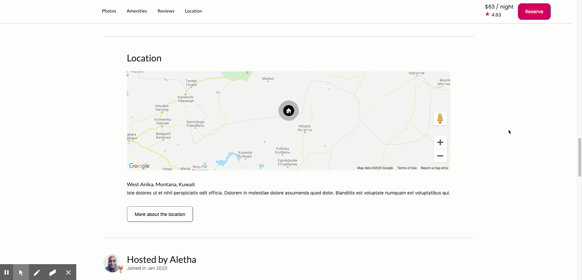

# Location Microservice

  A microservice for Airbnb Item Detail Page clone, Airbrb. It is created with Node.js, React and MongoDB

  

  >Airbnb users can zoom in and out of the map to check out location or click on 'More About Location' to get listing information

## Related Projects

  - Trello Board: https://trello.com/b/dR6Qp3HX/fec-airbrb
  - Github: https://github.com/Wilberg-Airbnb
  - **https://github.com/Wilberg-Airbnb/host** (microservice I developed)
  - https://github.com/Wilberg-Airbnb/reservation
  - https://github.com/Wilberg-Airbnb/reviews
  - https://github.com/Wilberg-Airbnb/suggestion
  - https://github.com/Wilberg-Airbnb/photos
  - https://github.com/Wilberg-Airbnb/description

## Table of Contents

1. [Usage](#Usage)
2. [Requirements](#requirements)
3. [Installation and Setup](#InstallationandSetup)
4. [Deployment](#deployment)


## Usage
  
  - GET URL: http://3.12.169.208:2001/api/location/:listingId
  - GET Endpoint: /api/location/:listingId

    Sample Output: 

    ```json
      {
          "address": {
              "street": "476 Rippin Roads",
              "city": "Muellerberg",
              "state": "Connecticut",
              "zipCode": "04528-2900",
              "country": "Andorra",
              "latitude": 17.0003,
              "longitude": -45.7531
          },
          "_id": "5eed9aab2bdca58a88f91467",
          "listingId": 2,
          "description": "Ut ipsa consequuntur. Omnis odit illum quasi laudantium et. Labore vel aut qui quos minus adipisci modi nemo. Fugiat quis accusantium voluptatem minus et. Unde voluptatibus veritatis maxime aut molestiae beatae totam ut.",
          "gettingAround": null,
          "__v": 0
      }
    ```

## Requirements

- Node 6.13.0
- Express 4.17
- React 16.13.1
- Mongoose 5.9.19
- MongoDB 4.2.6
- Bluebird 3.7.2
- Faker 4.1.0
- Styled-components
- Signup for Google Maps API & enable Maps JavaScript API [Link](https://console.developers.google.com/apis/)

## Installation and Setup

Setting up config.js file
  -add key
  -change file name from config_copy.js to config.js
  
From within the root directory:

```sh
 $ npm install 
 $ npm run seed 
 $ npm run server-dev
```


Service renders at:
    <div id="location"></div>
    <div id="about-modal"></div>
  
- if proxy server URL is: domain/:listingId/ then Bundle.js url: http://localhost:2001/public/bundle.js
- if proxy server URL is: domain?id=:listingId then Bundle.js url: http://localhost:2001/bundle.js


## Deployment

Create a Docker image and spin a container by running docker-compose.yml

```sh
docker-compose up
```


